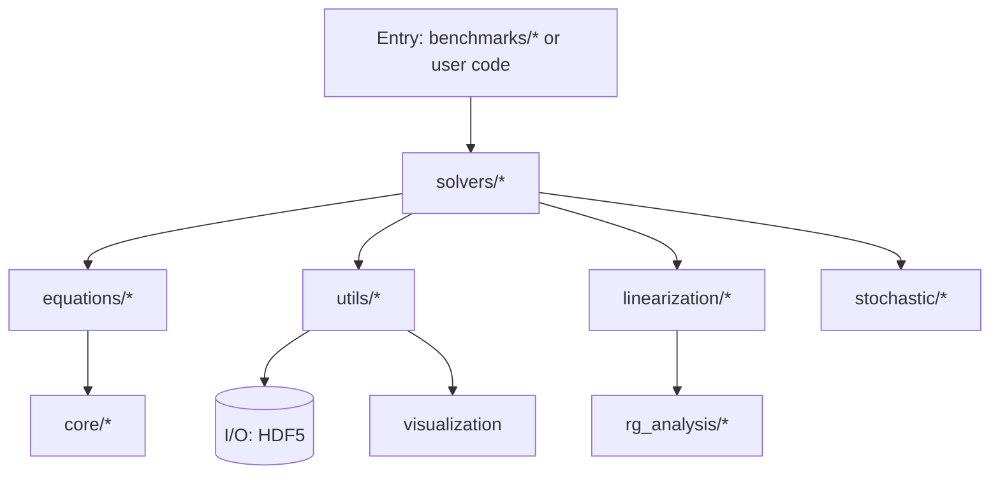

# Repository Guidelines

## Project Structure & Module Organization
- Source: `israel_stewart/`
  - `core/` (tensors, grids, metrics, derivatives)
  - `equations/` (conservation, relaxation, coefficients, constraints)
  - `solvers/` (finite_difference, implicit, spectral, splitting)
  - `linearization/`, `stochastic/`, `rg_analysis/`, `utils/`, `benchmarks/`
- Tests: `israel_stewart/tests/` (plus occasional root tests like `test_field_config.py`).

## Architecture Overview
The typical flow is: entry scripts or `benchmarks/` call `solvers/`, which use `equations/` built on `core/`. Utilities handle I/O and plotting; analysis modules are optional.

## Build, Test, and Development Commands
- Setup (all extras): `uv sync --all-extras`
- Lint/format: `uv run ruff check .` and `uv run ruff format .`
- Type check: `uv run mypy israel_stewart`
- Run tests (with coverage): `uv run pytest -q` (outputs term, `htmlcov/`, `coverage.xml`)
- Example run: `uv run python -m israel_stewart.benchmarks.bjorken_flow`

## Documentation
- Build HTML: `uv run sphinx-build -b html docs/source docs/build/html` then open `docs/build/html/index.html`.
- Generate API stubs: `uv run sphinx-apidoc -o docs/source/api israel_stewart -f -e` (re-run after API changes).
- Config: `docs/source/conf.py` reads `name`, `version`, and authors from `pyproject.toml`; theme is `sphinx_rtd_theme`.
- Hosting: `.readthedocs.yaml` builds docs via extras `docs` on Python 3.12.

## Coding Style & Naming Conventions
- Python 3.12; 4‑space indent; line length 88; double quotes (ruff configured).
- Type hints required (strict mypy). Prefer explicit returns and dataclasses where appropriate.
- Naming: modules/functions `snake_case`, classes `PascalCase`, constants `UPPER_SNAKE_CASE`.
- Keep public APIs small; document parameters and units in docstrings.

## Testing Guidelines
- Framework: pytest. Test files `test_*.py` or `*_test.py`; classes `Test*`; functions `test_*`.
- Markers: `slow`, `integration`, `benchmark` (e.g., `pytest -m "not slow"`).
- Aim for meaningful coverage of `core/`, `equations/`, and `solvers/`. Seed randomness in stochastic tests (e.g., `numpy.random.seed(0)`).

## Commit & Pull Request Guidelines
- Commits: follow Conventional Commits (`feat:`, `fix:`, `docs:`, `refactor:`, `test:`, `ci:`). Write imperative, concise messages.
- PRs: include a clear description, rationale, linked issues, and any performance/accuracy notes. Add plots or small outputs for `benchmarks/` when relevant.
- Requirements to merge: lint, mypy, and tests pass locally; new/changed code is covered by tests.

## Security & Configuration Tips (Optional)
- Reproducibility: set seeds and record grid/solver settings in output metadata.
- Numba: for debugging, you can set `NUMBA_DISABLE_JIT=1`. Control threads via `NUMBA_NUM_THREADS`.
- I/O: prefer `israel_stewart.utils.io` for HDF5; write outputs under a user‑specified directory.
